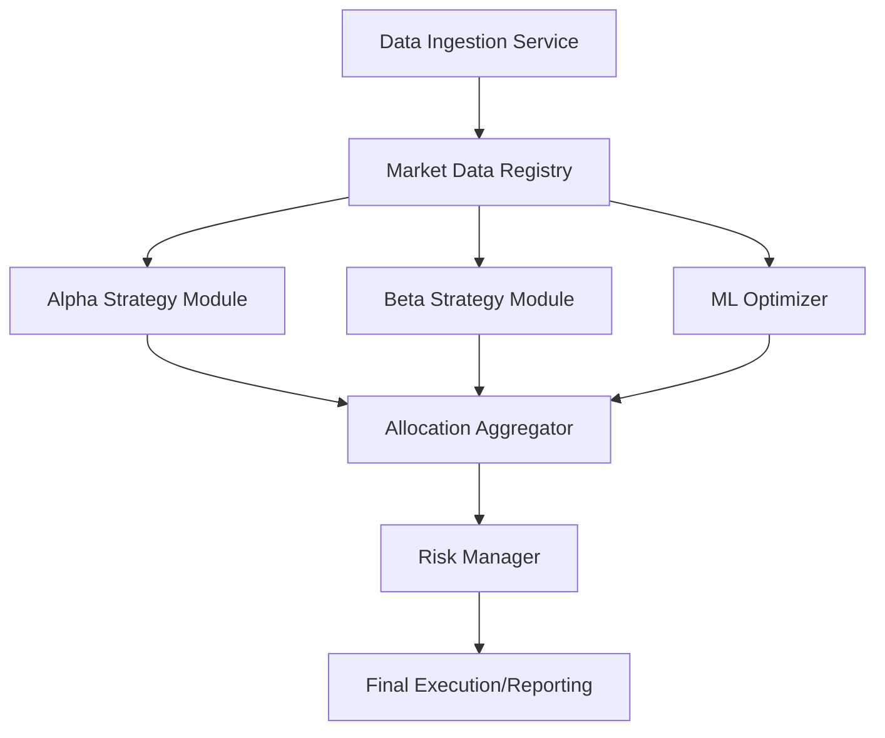

# Alpha-Beta Balancing System

A sophisticated Quantitative Investment & Risk Management Framework designed to optimize capital allocation between Alpha and Beta strategies. The system leverages machine learning for dynamic regime detection and rigorous risk guardrails to maximize risk-adjusted returns.

## 🚀 Overview

The **Alpha-Beta Balancing System** is a modular framework built to handle the complexities of modern financial markets. It combines traditional quantitative finance metrics (Sharpe, Sortino, Max Drawdown) with modern machine learning techniques to adapt to changing market conditions in real-time.

### Core Philosophy

- **Alpha Strategy**: Market-independent returns through mean reversion and factor models.
- **Beta Strategy**: Systematic exposure to broad market benchmarks (e.g., Nifty 50 - ^NSEI).
- **Dynamic Rebalancing**: ML-driven reallocation based on detected market regimes (Bull, Bear, Volatile).
- **Rigorous Risk Control**: Multi-layer risk management including stop-losses, position sizing, and diversification guardrails.

## ✨ Key Features

- **📊 Multi-Strategy Engine**: Simultaneous management of Alpha and Beta models.
- **🤖 ML-Powered Optimization**: Real-time regime detection and automated capital weights adjustment.
- **🛡️ Risk Management Framework**:
  - Automated Stop-Loss and Take-Profit logic.
  - Kelly Criterion & Risk Parity inspired position sizing.
  - Concentration limits across sectors and geographies.
- **📈 Advanced Analytics**:
  - Real-time performance tracking (Sharpe, Sortino, MaxDD).
  - Dynamic correlation matrices and heatmaps.
- **🖥️ Interactive Dashboard**: Premium web interface for multi-dimensional reporting and visualization.

## 🛠️ Tech Stack

- **Backend**: Python 3.8+, FastAPI, Uvicorn.
- **Data Science**: NumPy, Pandas, Scikit-learn (implied/extensible).
- **Frontend**: Vanilla JavaScript (ES6+), Modern CSS (Glassmorphism), HTML5.
- **API**: RESTful architecture.

## 📁 System Architecture



## 🚥 Getting Started

### Prerequisites

- Python 3.8 or higher
- `pip` (Python package manager)

### Installation

1. Clone the repository:
   ```bash
   git clone https://github.com/your-repo/alpha-beta-system.git
   cd alpha-beta-system
   ```
2. Set up a virtual environment:
   ```bash
   python -m venv .venv
   source .venv/bin/activate  # On Windows: .venv\Scripts\activate
   ```
3. Install dependencies:
   ```bash
   pip install fastapi uvicorn pandas numpy
   ```

### Running the Application

#### 1. Web Dashboard (Live API)

Launch the FastAPI server to access the interactive dashboard:

```bash
python app.py
```

Open `http://localhost:8000` in your browser.

#### 2. CLI Simulation Demo

Run the Phase 3 simulation to see the dynamic allocation and risk management in action:

```bash
python main.py
```

## 🗺️ Roadmap

- [ ] **Phase 1**: Foundation (Data & Infrastructure) - _Completed_
- [ ] **Phase 2**: Strategy Engine & Performance Analytics - _Completed_
- [ ] **Phase 3**: Risk Management & ML Feedback Loop - _Completed_
- [ ] **Phase 4**: Unified Analytics Dashboard & Multi-asset reporting - _Completed_

## 📜 License

This project is licensed under the MIT License - see the LICENSE file for details.
